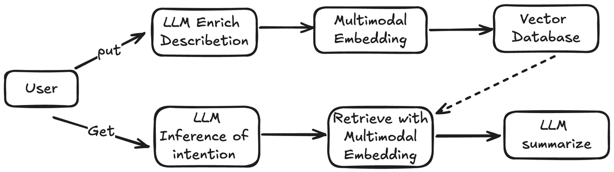
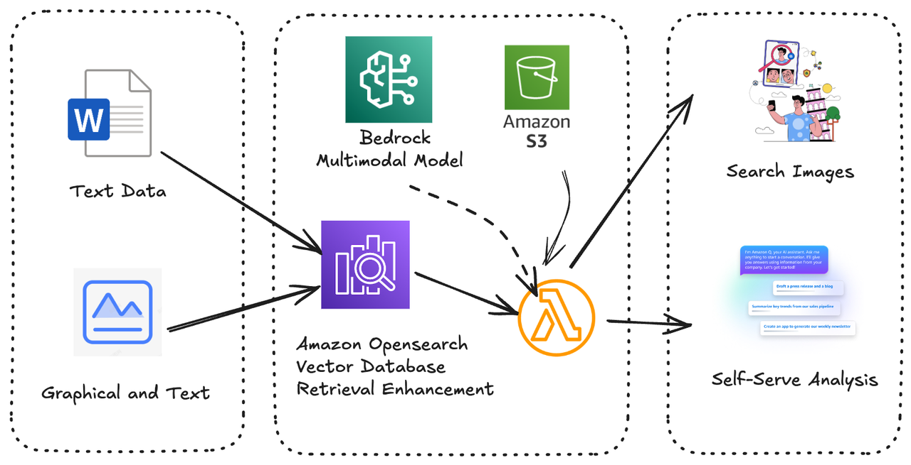
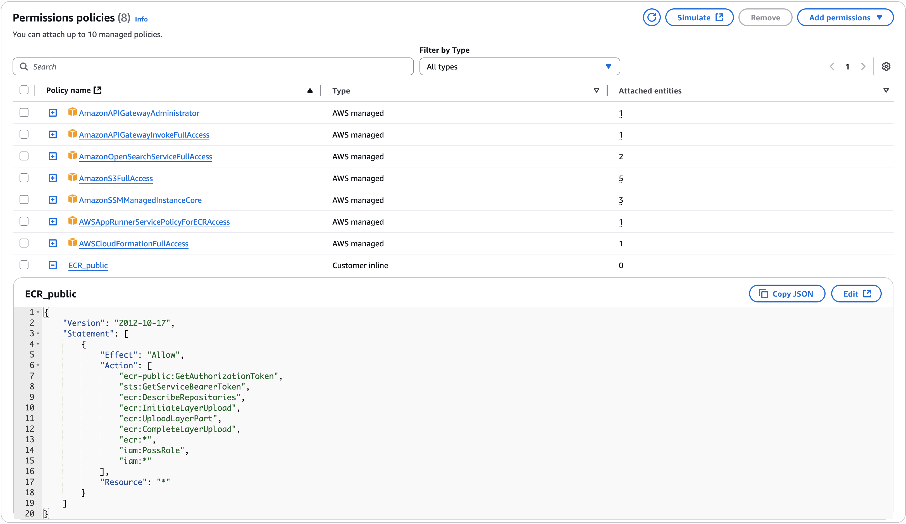

# Images 多模态搜索


## 架构说明





**组件说明**

Amazon Bedrock: 是Amazon 完全托管的AI服务，通过API的方式提供访问多种FMs 比如Anthropic/AI21 Labs/Cohere/Meta等模型

Amazon Opensearch: 是AWS完全托管的Text Search/Vector 数据库

Amazon S3:  Amazon S3是高可用的，几乎无限扩张的对象存储服务, 这边我们使用它来存储图片

Amazon Lambda: 是Amazon Serverless的计算服务，在这边封装了image search的API如upload image/search image等

## 部署说明

利用 ARM 架构 EC2 （如T4g），Amazon linux 2023 系统部署参考

1. 开启SSH访问安全组
2. 采用Session Manager方式连接到EC2
3. 配置对应Session Manager的IAM Role（在实例描述中可以找到）权限如下图所示
   
4. 运行以下命令

    ```
    sudo yum install npm
    npm install -g aws-cdk
    sudo yum install docker 
    service docker start
    ```

    ```
    # 登陆aws public ECR 获取基础镜像（多阶段构建，这边是通过Lambda Web Adapter的镜像层构建Lambda容器）
    aws ecr-public get-login-password --region us-east-1 | docker login --username AWS --password-stdin public.ecr.aws
    ```

    ```
    # CDK依赖
    npm install

    # CDK在AWS上做环境准备的。引导Stacksets在AWS环境配置S3存储桶和ECR镜像仓库的配置
    sudo cdk bootstrap

    # CDK进行部署
    sudo cdk deploy
    ```

## 测试说明

1. 利用ssh远程连接ec2，并map到本地8888端口，启动Jupyter notebook服务器

2. 上传 'test_image_upload_and_search.ipynb' 文件，根据注释修改对应内容并进行测试即可

### 工程结构说明

```
├── API_Docs.md  //API文档
├── README.md
├── asserts
├── bin
├── cdk.context.json
├── cdk.json
├── image
├── jest.config.js
├── lambda     //业务逻辑
├── lib
├── package.json
└── tsconfig.json
```

